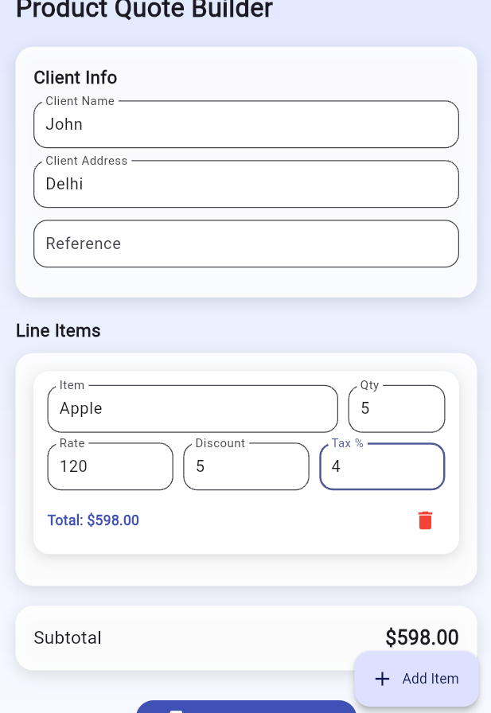
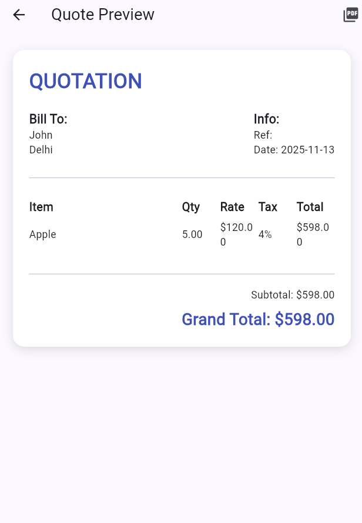

# Product-Quote-Builder-Application
Build a Product Quote Builder 
�
� Objective 
Develop a product quotation form that allows users to input multiple products or services, calculates 
totals in real-time, and presents the quote in a professional layout. 
�
� What We Want to See 
• Ability to work with nested dynamic lists 
• Responsive layout for multiple line items 
• Real-time business logic calculations 
• UI organization for professional B2B tools 
�

#App Look

 

� Requirements 
1. Quote Form UI 
a. The user should be able to input:  
i. 
Client Info (name, address, reference) 
ii. 
Line items, each with:  
1. Product/Service name 
2. Quantity 
3. Rate 
4. Discount (optional) 
5. Tax % 
b. Allow adding/removing rows 
2. Auto Calculations 
a. Per-item total: ((rate - discount) * quantity) + tax 
b. Quote subtotal (sum of all items) 
c. 
Grand total 
3. Responsive Layout 
a. UI should adapt gracefully on small and large screens 
b. Spacing, grouping, and alignment must look professional 
4. Preview Section 
a. Display a preview of the completed quote in a clean, printable layout 
